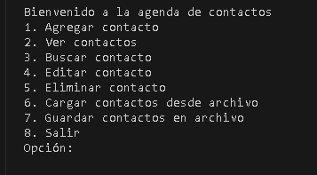
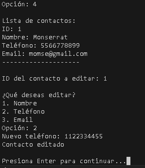
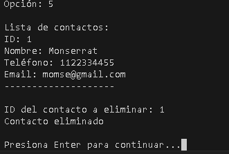
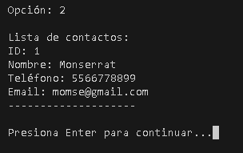
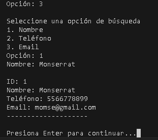
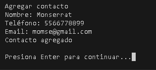

# <p align="center">GESTOR DE CONTACTOS</p>  

## Descripción del proyecto  
Se desarrolló un programa en lenguaje Python que funciona como un gestor de contactos, utilizando **GitHub** para el control de versiones y **Microsoft Planner** para la gestión de tareas y la colaboración en equipo.  

El gestor de contactos permite al usuario:  
- Agregar nuevos contactos (nombre, teléfono, correo electrónico).  
- Mostrar la lista de contactos.  
- Buscar un contacto por nombre.  
- Editar la información de un contacto.  
- Eliminar un contacto.  
- Guardar los contactos en un archivo de texto.  
- Cargar los contactos desde un archivo de texto.  

Además, trabajamos en equipo utilizando **GitHub** para gestionar el código y **Microsoft Planner** para organizar y asignar tareas.  

## Instrucciones para ejecutar el programa  

### 1. Requisitos previos  
Para ejecutar este proyecto, necesitas:  
- **Python** instalado en tu sistema.  
- Un editor de código, como **Visual Studio Code**.  
- La extensión **Python** en VS Code (opcional, pero recomendada).  

### 2. Descargar o clonar el repositorio  
Para obtener el código del proyecto:  
1. Ve a la página del repositorio en **GitHub**.  
2. Haz clic en el botón **Code** y selecciona **Download ZIP**.  
3. Extrae el contenido del archivo ZIP en una carpeta local.  
4. (Opcional) También puedes clonar el repositorio con el siguiente comando en tu terminal:  
   ```bash
   git clone <URL_DEL_REPOSITORIO>
   ```

### 3. Ejecutar el programa  
1. Abre la carpeta del proyecto en **Visual Studio Code** (o en tu editor preferido).  
2. Abre la terminal e ingresa el siguiente comando para ejecutar el programa:  
   ```bash
   python gestor_contactos.py
   ```

## Capturas de pantalla del programa  
### Menú principal  
  

### Editar contacto  
  

### Eliminar contacto  
  

### Ver contactos  
  

### Buscar contacto  
  

### Agregar contacto  
  

## Enlace al tablero de Microsoft Planner  
Puedes acceder a nuestro tablero en **Microsoft Planner** en el siguiente enlace:  
🔗 [Microsoft Planner](https://planner.cloud.microsoft/webui/v1/plan/VrO_cMGBSU6pG2kWRZDioGQABI91?tid=f94bf4d9-8097-4794-adf6-a5466ca28563)

---
## Integrantes
- Carranza Mercado Jesus Eduardo
-  Gonzalez Pérez Monserrat
- Pérez Méndez Nancy Esmeralda
- Valencia Hernandez Kevin Guadalupe
- Zamudio Lopez Leonardo
  
