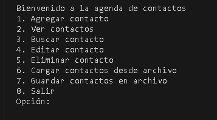
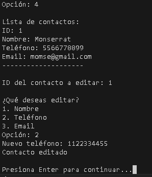
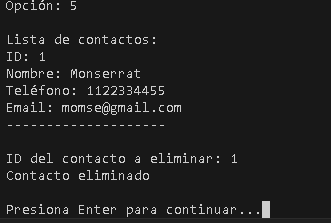
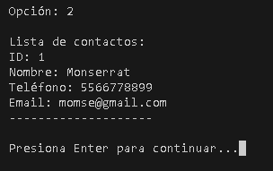
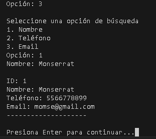
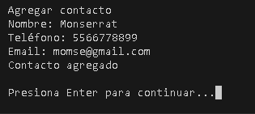

# 
 GESTOR DE CONTACTOS 

## Descripcion del proyecto  
Se desarrollo un programa en lenguaje Python que funcione como un gestor de contactos, utilizando   GitHun para el control de versiones y Microsoft Planner para la gestión de tareas y colaboración en equipo.  
  
El gestor de contactos permitirá al usuario:  
  * Agregar nuevos contactos (nombre, télefono, correo electrónico).
  * Mostrar la lista de contactos.
  * Buscar un contacto por nombre.
  * Eliminar un contacto.
  * Guardar los contactos en un archivo de texto.
  * Cargar los ocntactos desde un archivo de texto.
   
Además, trabajamos en equipo utilizando GitHub para el control de versiones del código y Microsoft Planner para organizar y asiganar las tareas.  

  ## Instrucciones para compilar y ejecutar el programa  
  **1. Requisitos previos.**  
    
  Para compilar y ejecutar este proyecto, necesitarás:
  - Visual Studio Code.
  - Instalar la extensión "Python".
  - Instalar compiladores o intérpretes, en este caso sería Python.
  
  **2. Descarga o clonación del repositorio.**  
  * Cómo descargar o clonar el repositorio:
    - Ve a la página del proyecto en GitHub.
    - Haz clic en el botón "Code" y selecciona "Download ZIP".
    - Extrae el contenido del archivo ZIP en una carpeta local.
  
  **3. Compilación y ejecución del programa.**  
  * Comando para compilar el programa: "Run Python File".
  ## Capturas de pantalla del programa en funcionamiento  

  ## Enlace al tablero de Microsoft Planner  
  Enlace al Microsoft Planer: https://planner.cloud.microsoft/webui/plan/VrO_cMGBSU6pG2kWRZDioGQABI91/view/grid?tid=f94bf4d9-8097-4794-adf6-a5466ca28563
